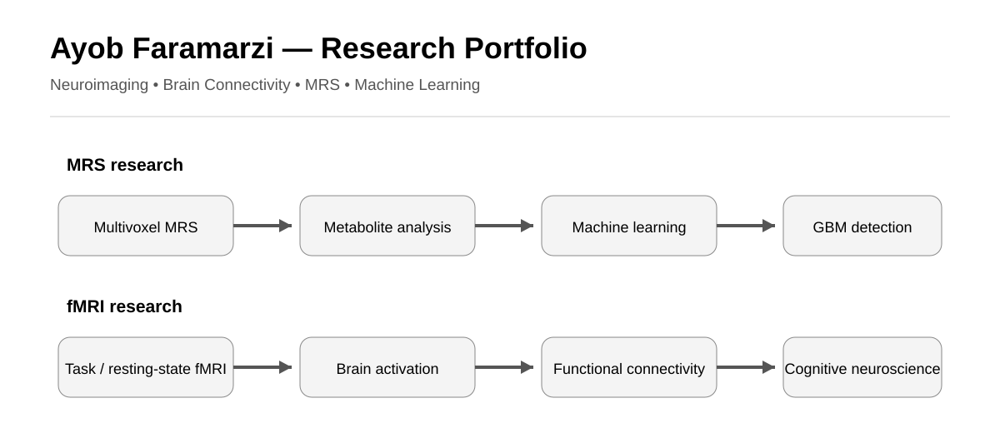

# Ayob Faramarzi

### Biomedical Engineer | Neuroimaging | fMRI | MRS | Brain Connectivity | Machine Learning

I am a biomedical engineer with a research background in neuroimaging, functional magnetic resonance imaging (fMRI), magnetic resonance spectroscopy (MRS), brain connectivity, signal processing, and machine learning.

My research experience includes fMRI studies of cognitive control, anhedonia, and pain-related brain networks, as well as MRS-based analysis and machine learning approaches for glioblastoma. I am interested in computational approaches for studying brain function, connectivity, and individual differences in neural dynamics.

## Research Interests

- Cognitive Neuroscience
- Computational Neuroimaging
- Functional MRI (fMRI)
- Brain Connectivity
- Functional and Effective Connectivity
- Cognitive Control
- Medical Imaging
- Magnetic Resonance Spectroscopy (MRS)
- Machine Learning
- Deep Learning

## Selected Research Projects

### fMRI and Cognitive Neuroscience

- [fMRI-Cognitive-Control](https://github.com/AyobFaramarzi/fMRI-Cognitive-Control) — Attentional control and functional connectivity during a visual modified Flanker task.
- [fMRI-Anhedonia-Brain-Connectivity](https://github.com/AyobFaramarzi/fMRI-Anhedonia-Brain-Connectivity) — Brain responses and frontolimbic effective connectivity associated with anhedonia during music stimulation.
- [fMRI-Insula-Brain-Connectivity](https://github.com/AyobFaramarzi/fMRI-Insula-Brain-Connectivity) — Pain-related brain networks and insula–prefrontal effective connectivity following LSD administration.
- [fMRI-Duloxetine-Pain-Networks](https://github.com/AyobFaramarzi/fMRI-Duloxetine-Pain-Networks) — Resting-state brain activity and connectivity related to duloxetine treatment in knee osteoarthritis.

### MRS and Medical Imaging

- [MRS-Glioblastoma-Machine-Learning](https://github.com/AyobFaramarzi/MRS-Glioblastoma-Machine-Learning) — MRS-derived metabolic features and machine learning for glioblastoma tumor detection.
- [MRS-Glioblastoma-Metabolite-Analysis](https://github.com/AyobFaramarzi/MRS-Glioblastoma-Metabolite-Analysis) — Multivoxel MRS analysis of metabolite differences between tumoral and normal brain voxels.

## Publications

### fMRI and Brain Connectivity

1. [Attentional Control during Visual Modified Flanker Stimuli using fMRI Data](https://doi.org/10.31661/jbpe.v0i0.2408-1813) — *Journal of Biomedical Physics & Engineering*, 2026.
2. [The Effect of Duloxetine on Brain Neural Activity and Pain Processing in Patients with Knee Osteoarthritis: An fMRI-Based Study](https://doi.org/10.48305/jims.v43.i817.0574) — *Isfahan Medical School Journal*, 2025.
3. [Clinical utility of fMRI in evaluating of LSD effect on pain-related brain networks in healthy subjects](https://doi.org/10.1016/j.heliyon.2024.e34401) — *Heliyon*, 2024.
4. [Anhedonia Symptoms: The Assessment of Brain Functional Mechanism Following Music Stimuli Using Functional Magnetic Resonance Imaging](https://doi.org/10.1016/j.pscychresns.2022.111532) — *Psychiatry Research: Neuroimaging*, 2022.

### MRS and Glioblastoma

5. [Semi-Automated Glioblastoma Tumor Detection Based on Different Classifiers Using Magnetic Resonance Spectroscopy](https://doi.org/10.18502/fbt.v8i3.7113) — *Frontiers in Biomedical Technologies*, 2021.
6. [Analysis of Glioblastoma Multiforme Tumor Metabolites Using Multivoxel Magnetic Resonance Spectroscopy](https://pubmed.ncbi.nlm.nih.gov/32431795/) — *Avicenna Journal of Medical Biotechnology*, 2020.
7. [Detection of Glioblastoma Multiforme Tumor in Magnetic Resonance Spectroscopy Based on Support Vector Machine](https://ijmp.mums.ac.ir/article_12927.html) — *Iranian Journal of Medical Physics*, 2018.

## Research Methods and Tools

**Neuroimaging:** MATLAB, SPM12, CONN, GIFT, DPABI  
**MRS:** TARQUIN, SIVIC, LCModel-based signal fitting  
**Statistics:** SPSS  
**Methods:** fMRI preprocessing, GLM, functional connectivity, effective connectivity, DCM, ICA, ROI-to-ROI analysis, graph theory, ROC analysis, machine learning classification

## Education

**M.Sc. in Biomedical Engineering (Bio-Electric)**  
Kermanshah University of Medical Sciences

**B.Sc. in Electrical Engineering (Electronics Engineering)**  
Razi University

## Research Direction

My research direction is at the intersection of neuroimaging, brain connectivity, and artificial intelligence, with a focus on understanding how brain networks support cognition and how their dynamics vary across individuals and conditions.

## Links

- [Google Scholar](https://scholar.google.com/citations?hl=en&user=1uivc_4AAAAJ)
- [LinkedIn](https://www.linkedin.com/in/ayob-faramarzi/)
- [GitHub](https://github.com/AyobFaramarzi)

## Contact

Email: ayobfaramarzi@gmail.com
